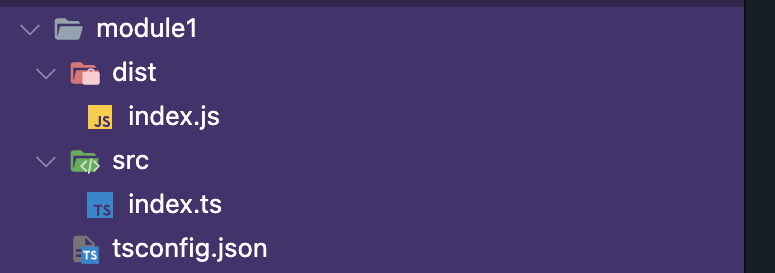

## First steps

-  make a `index.ts` file, or anything your name ending with .ts
-  run `tsc index.ts`
-  run `node index.js`

## JavaScript file should not be in the same folder as TypeScript files

We should now configure typeScript configuration file.

-  in your root folder, run `tsc --init`
-  in the configuration file now:
-  change the `rootDir` like below:

```json
"rootDir": "./src/"
```

The above folder path will depend on us.

-  change the `outDir`, where the js files will be stored

```json
"outDir": "./dist/"
```

-  then run `tsc` in the console and the folders will be created

End Result:



## Watch the file automatically

Install once:

```
npm i -g ts-node-dev
```

Then run the command:

```
ts-node-dev --respawn --transpile-only index.ts
```

aikhane index.ts er path ta specifically bolte hobe jodi onno kono folder e thake.
