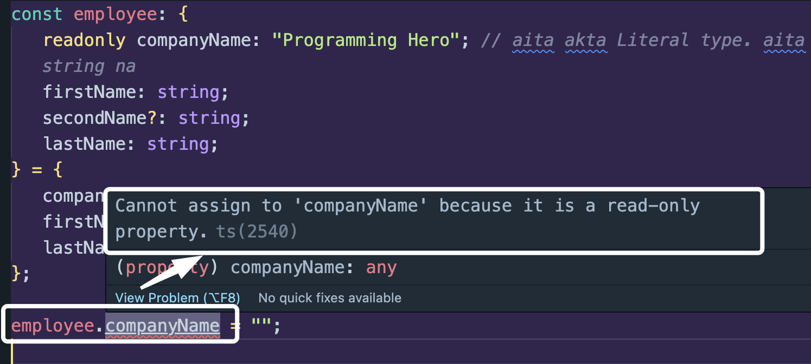

## Implicit and Explicit

Implicit: Amra kono data type mention korbona. TypeScript nije nije infer kore nibe aita ki data type.

Explicit: Amra explicitly bole dibo data type ki hobe.

## Primitive Data type

### String

```ts
let string: string = "Next level web development";
console.log(string);
```

### Number

```ts
let roll: number = 123;
```

### Boolean

```ts
let isAdmin: boolean = true;
```

### Undefined

```ts
let x: undefined = undefined;
```

### Null

```ts
let y: null = null;
```

### Any (Not recommended)

Below TS will show no error to us.

```ts
let d;

d = 123;
d = "hello";
d = false;
```

## Non primitive data type

### Array

```ts
let numbers: number[] = [5, 1, 6];
let names: string[] = ["Noor", "Tushar", "Khan"];
```

### Tuple

Tuple use ken kori?

Karon amray array declare korar time e hoy number boltesi ba string ba kichu boltesi.

Kintu amon to hotey parey je amra first ta number and second value ta string chai.

shei khetre tuple use korte pari.

Case 1:

```ts
let ageName: [number, string] = [18, "Tushar"];
```

Case 2: Amra chai number e hok array ta kintu duitar beshi value jate na boshe.

```ts
let coordinates: [number, number] = [1, 3];
```

### Object

#### Case 1: Shob property name and type declare korlam.

```ts
const employee: {
   firstName: string;
   secondName: string;
   lastName: string;
} = {
   firstName: "Noor",
   secondName: "Tushar",
   lastName: "Khan",
};
```

#### Case 2: Amon to hoite pare je akta employeer middle name nai. Case 1 er moto declare korle amader type error dibe. Tahole solution ki? Solution hoilo `Optional` type.

Kibhabe dey - using `?` mark

```ts
const employee: {
   firstName: string;
   secondName?: string;
   lastName: string;
} = {
   firstName: "Noor",
   lastName: "Khan",
};
```

Aikhane second name er type ta hoilo - `string | undefined`

#### Case 3: Ok now amon to hoite pare je amra akta specific value shob shomoy fixed rakhte chai. Example `companyName`. Aita to fix e thaka uchit.

```ts
const employee: {
   companyName: "Programming Hero"; // aita akta Literal type. aita kintu string na
   firstName: string;
   secondName?: string;
   lastName: string;
} = {
   companyName: "Programming Hero",
   firstName: "Noor",
   lastName: "Khan",
};
```

So aikhane bujhar jinish holo:
"Programming Hero" akta `type` hoye gese.. aita kintu `string` na. So jokhon `companyName` er value er type `"Programming Hero"` na hobe, tokhon amader error dibe. So amader must be same name tai dite hobe - ai same name manei same `type`.

#### Case 4: readonly

so amon akta property jeita r amra value access e korte dibona change korar jonne, shei property r agey readonly diye dibo.

```ts
const employee: {
   readonly companyName: "Programming Hero"; // aita akta Literal type. aita kintu string na
   firstName: string;
   secondName?: string;
   lastName: string;
} = {
   companyName: "Programming Hero",
   firstName: "Noor",
   lastName: "Khan",
};

employee.companyName = "";
```

amader ai code e companyName e value e assign korte dibena kono as it is only `readonly`


