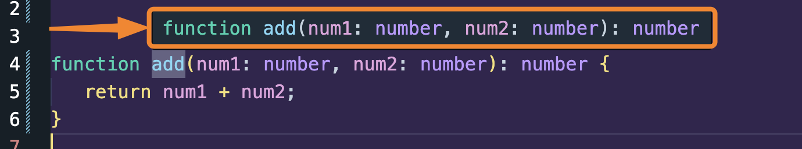
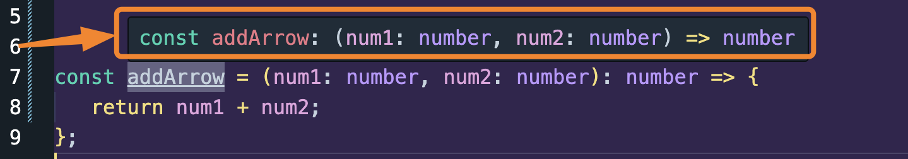
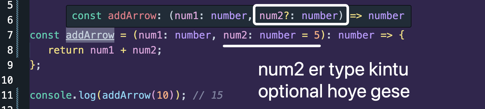

## 🟪 Defining Types both of arguments and return value

### Case 1: Normal Function

```ts
function add(num1: number, num2: number): number {
   return num1 + num2;
}
```



### Case 2: Arrow Function

```ts
const addArrow = (num1: number, num2: number): number => {
   return num1 + num2;
};
```



## 🟪 Setting Default Parameter for the arguments.

```ts
const addArrow = (num1: number, num2: number = 5): number => {
   return num1 + num2;
};

console.log(addArrow(10)); // 15
```



## Creating methods

addBalance method ta kheyal koro. Amra parameter ta number type disi and return value ta string type disi.

```ts
const poorPerson = {
   name: "Nike",
   balance: 0,
   addBalance(balance: number): string {
      this.balance += balance;
      return `My new balance is ${this.balance}`;
   },
};

poorPerson.addBalance(90);

console.log(poorPerson);
// { name: 'Nike', balance: 90, addBalance: [Function: addBalance] }
```

## Using Map method

```ts
const arr: number[] = [2, 4, 5];

const newArr: number[] = arr.map(
   (element: number): number => element * element
);
```

dekho koto gula jaegae type define korsi

-  `arr` bolsi aita number type array hobe
-  `newArr` keo bolsi aita number type array hobe
-  ekekta `element` je pabo oitao bole disi je number hobe
-  and `return value` tao je number hobe oitao bole disi
