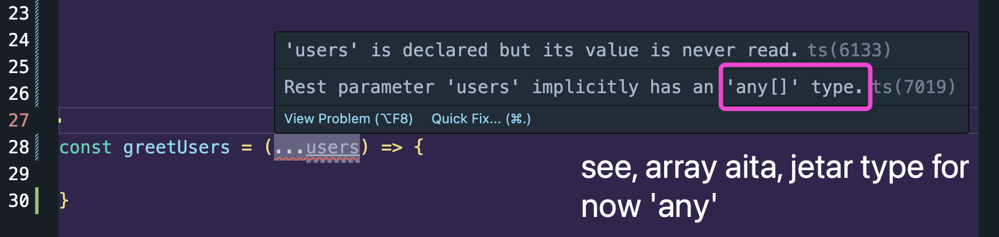

## 🟪 Spread Operator: bhenge fele

### 👉 Array spread

suppose duita array ase and amra first array te second array r shob elements gula add korte chai.

```ts
const fruits1: string[] = ["apple", "banana", "orange"];
const fruits2: string[] = ["pineapple", "berries", "coconut"];

fruits1.push(...fruits2);
console.log(fruits1);
// [ 'apple', 'banana', 'orange', 'pineapple', 'berries', 'coconut' ]
```

### 👉 Object spread

```ts
const courses1 = { javascript: "Tushar", python: "Jack" };
const courses2 = { java: "Shraddha", c: "Hussain" };

const allCourses = { ...courses1, ...courses2 };

console.log(allCourses);
/*
{
  javascript: 'Tushar',
  python: 'Jack',
  java: 'Shraddha',
  c: 'Hussain'
}
*/
```

## 🟪 Rest Operator: combine kore array banae.

Amra suppose akta function e jotogula name dibo togula ke Hi message dite chai.

So problem is amra argument er against jodi khali parameter e dite thaki tahole jinishta inefficient. Tai amra rest operator use kori.

Example,

Note, rest operator use korle aita akta array return kore.



```ts
const greetUsers = (...users: string[]) => {
   users.forEach((user: string) => console.log(`Hi ${user}`));
};

greetUsers("Tushar", "Santu", "Umaiza");
/*
Hi Tushar
Hi Santu
Hi Umaiza
*/
```

aikhane type use korsi kishey kishey?

-  rest operator e jei array type ta dibe sheikhane `string[]` type disi
-  element gula individually `string` type hobe sheita disi
