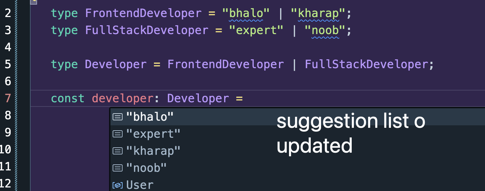

## 🟪 Union

Union hocchey JS er oi OR er moto. OR e jemon `||` duita thakto, union e ekta `|`

Aita use kora hoy so that akta user multiple types er moddhey value set korte pare.

### Example 1: String union

```ts
type FrontendDeveloper = "bhalo" | "kharap";

const developer: FrontendDeveloper = "bhalo";
```

Aikhane jeita hoise, FrontendDeveloper hoilo akta type jar value type kinta "bhalo" and "kharap"

### Example 2: Object union

```ts
type User = {
   name: string;
   age: number;
   gender: "male" | "female";
};

const userOne: User = {
   name: "Tushar",
   age: 18,
   gender: "male",
};
```

### Union combo 🔥

amra combo te ki korbo? duita type ke akshathe union korbo.

Example:

```ts
type FrontendDeveloper = "bhalo" | "kharap";
type FullStackDeveloper = "expert" | "noob";

// akhon uporer duita type ke akshathe korbo
type Developer = FrontendDeveloper | FullStackDeveloper;

const developer: Developer = "kharap";
```



## 🟪 Intersection

Intersection hoilo jora deya. Mane duita type ke jora deya. JS er AND er moto.

### Example1 : Intersection Object

```ts
type FrontendDeveloper = {
   name: string;
   designation1: "Frontend Developer";
};

type BackendDeveloper = {
   name: string;
   designation2: "Backend Developer";
};

type FullstackDeveloper = FrontendDeveloper & BackendDeveloper;

const user: FullstackDeveloper = {
   name: "Tushar",
   designation1: "Frontend Developer",
   designation2: "Backend Developer",
};
```

Aikhane object tate finally 3 ta properties must dite hobe jeigular type o amra specify kore disi.
