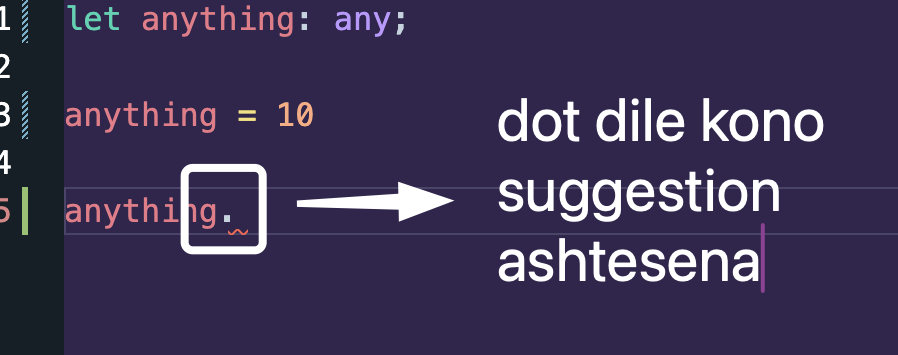
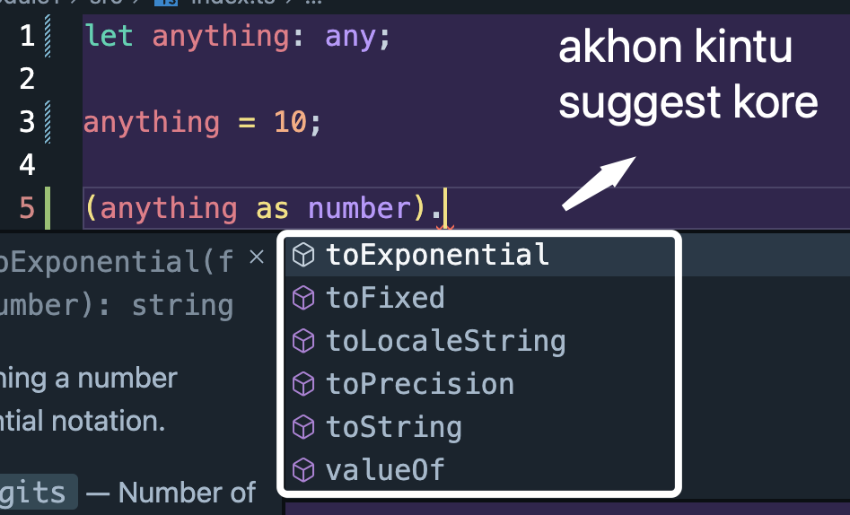
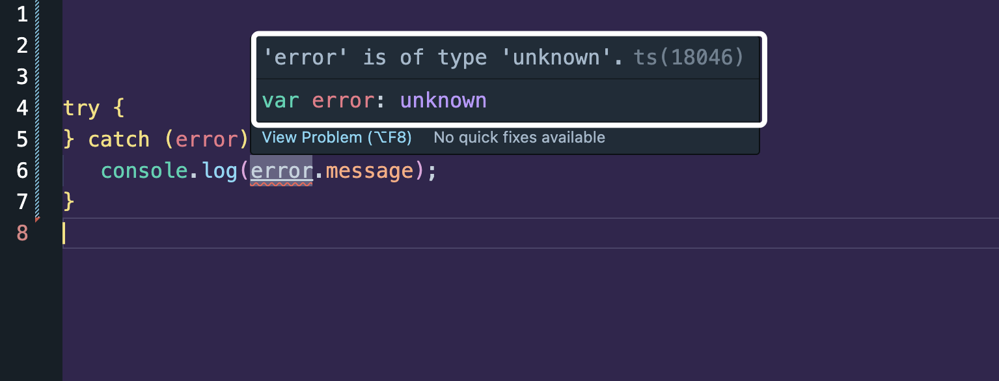

AMRA TYPESCRIPT THIKE BESHI BUJHI - aitai hoilo Type Assertion.

### Example 1

Jokhon amra `any` type declare kori, amader kintu typescript kono suggestion dite parena. Mane hocchey, jemon string hoile to `.` dile string er methods gula suggest kore. Kintu type `any` dile kono suggestion dey na. Tokhon amra ki korte pari, amra type assertion use kore bole dite pari amader type ta.



Type assertion use korar jonne amader `as` use korte hobe.

```ts
let anything: any;

anything = 10;

(anything as number).toFixed(2);
```



### Example 2

Aikhane amra janina ashole ki type return hoitese.

```ts
const kgToGm = (value: number | string): number | string | undefined => {
   if (typeof value === "number") {
      const convertedValue = value * 1000;
      return convertedValue; // number hoile number return kortesi
   }

   if (typeof value === "string") {
      const convertedValue = parseFloat(value) * 1000;
      return `The converted value is ${convertedValue}g`; // string value hoile string return kortesi
   }

   // and string ba number konota jodi na pai tahole undefined return kortesi
};
```

But amra jehutu TS thike beshi bujhi. Amra pore `as` diye type assertion kore felte pari. So amra akhon jeita korbo sheita hoilo:

```ts
const result1 = kgToGm("1000") as string; // amra jani string return hobe
result1.charAt(2); // amra aikhane string method use korte partesi

const result2 = kgToGm(1000) as number; // amra jani je number return hobe
result2.toFixed(2); // amra aikhane number er method use korte partesi
```

### Example 3: Advanced Example - Try Catch

Amra jani try catch e amra error pai catch block e. And amra `error.message` dekhar try kori. Kintu TS e normally dekhte chaile amon akta error dibe.



Type ta chinte partesena bechara.

Tahole chinanor jonne amra akta custom type banaye type assert kore dite pari.

```ts
type CustomError = {
   message: string;
};

try {
} catch (error) {
   console.log((error as CustomError).message);
}
```

akhon kono error dekhacche na. Cause error hocchey akhon akta object type jeitar moddhey message ase, jeita kina string type.

### 🔥 Important Points to remember -

-  `as` diye type assertion korle oitai kintu final hobe. Type ta jodi bhul o hoy, TypeScript amader deya type tai consider korbe.

```

```
