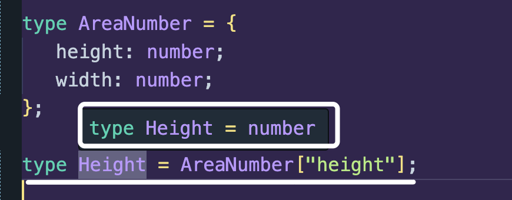
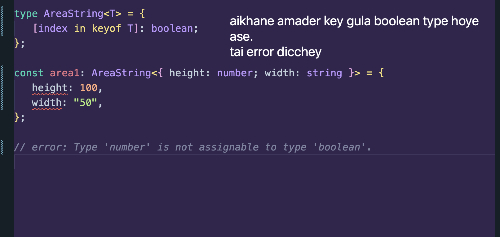
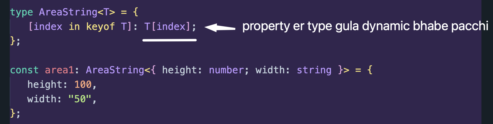

## 🟪 Recalling Map with little TS

```ts
const arrOfNumbers: number[] = [1, 3, 5];

const arrOfStrings: string[] = arrOfNumbers.map((element: number): string =>
   element.toString()
);

console.log(arrOfStrings); // [ '1', '3', '5' ]
```

NOTE: Amra aita ken korlam?

-  kaaj easy korar jonne
-  map use kore auto korar jonne, nahole amra chaile manually string array ta banaite partam.

## 🟪 Map Type

So above reasons er jonne similar akta case jodi dekhi, but aibar type er khetre. Jemon:

```ts
type AreaNumber = {
   height: number;
   width: number;
};

type AreaString = {
   height: string;
   width: string;
};
```

Dekho just akta type change korar jonne amra new akta `type` declare korsi. But aitai ki amra map er moto auto convert korte pari? Pari using `Map Types`

## 🟪 How to code Map Types

```ts
type AreaNumber = {
   height: number;
   width: number;
};

// type AreaString = {
//    height: string;
//    width: string;
// };

type AreaString = {
   [index in "height" | "width"]: string; // same output tai dibe
};
```

But aita jehutu hard code kore korsi and dynamic na. Amra dynamic chaile aibhabe korte pari:

```ts
type AreaNumber = {
   height: number;
   width: number;
};

// type AreaString = {
//    height: string;
//    width: string;
// };

type AreaString = {
   [index in keyof AreaNumber]: string; // same output tai dibe
};
```

## 🟪 Generic use of Map Types

Ok one thing, amra jokhon object thike property r value nite chai tokhon amra bracket notation use kori right?

Similary, amra akta type thike type ber anti pari bracket notation aibhabe use kore:



So amra akhon generic akta reusable Type banaite chai aibhabe:



To solve this and make it dynamic:



Code:

```ts
type AreaString<T> = {
   [index in keyof T]: T[index];
};

const area1: AreaString<{ height: number; width: string }> = {
   height: 100,
   width: "50",
};
```
