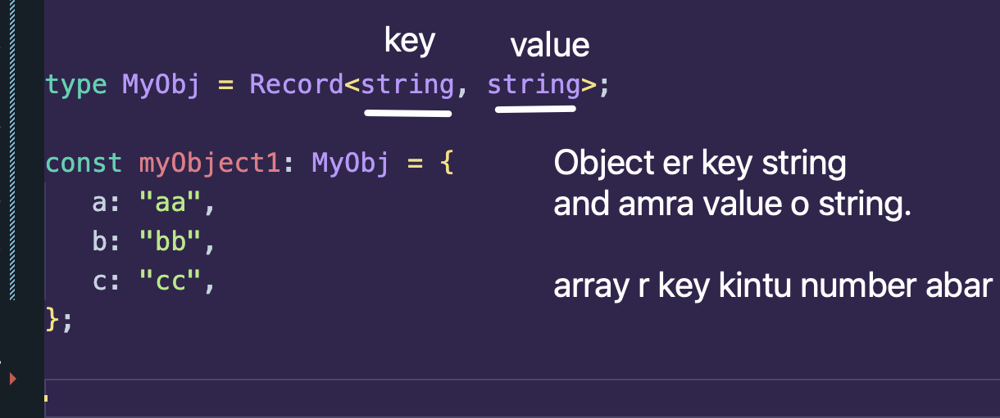

## 1. Pick

Pick ki kore? Pick kore niye ashe akta type ke or multiple types ke.

Example:

```ts
type Person = {
   name: string;
   age: number;
   email: string;
   phone: string;
};

type Name = Pick<Person, "name">;

/*
type Name = {
    name: string;
}
*/

type NameAge = Pick<Person, "name" | "age">;

/*
type NameAge = {
    name: string;
    age: number;
}
*/
```

## 2. Omit

Omit kore baki type gula dao.

```ts
type Person = {
   name: string;
   age: number;
   email?: string;
   phone: string;
};

type ContactInfo = Omit<Person, "name" | "age">;

/*
   type ContactInfo = {
      email?: string | undefined;
      phone: string;
   }
*/
```

## 3. Required

Forces all the properties to be required

```ts
type Person = {
   name: string;
   age: number;
   email?: string;
   phone: string;
};

type PersonRequired = Required<Person>;

/*
type PersonRequired = {
    name: string;
    age: number;
    email: string;
    phone: string;
}
*/
```

## 4. Partial

Shob dhore forcefully optional banaye dibe.

```ts
type Person = {
   name: string;
   age: number;
   email?: string;
   phone: string;
};

type PersonPartial = Partial<Person>;

/*
type PersonPartial = {
    name?: string | undefined;
    age?: number | undefined;
    email?: string | undefined;
    phone?: string | undefined;
}
*/
```

## 5. Read Only

```ts
type Person = {
   name: string;
   age: number;
   email?: string;
   phone: string;
};

type PersonReadOnly = Readonly<Person>;

const person1: PersonReadOnly = {
   name: "Tushar",
   age: 16,
   phone: "10515",
};

person1.name = "Jack";

// ERROR: Cannot assign to 'name' because it is a read-only property
```

## 🔥 6. Record

Error first e kheye dekhi:

```ts
type MyObj = {
   a: string;
   b: string;
};

const myObject1: MyObj = {
   a: "aa",
   b: "bb",
   c: "cc",
};

// ERROR: Object literal may only specify known properties, and 'c' does not exist in type 'MyObj'.
```

So amra jate dynamically jekono property add korle oitar type ta o set hoy shei khetre amra aibhabe korte pari:



```ts
type MyObj = Record<string, string>;

const myObject1: MyObj = {
   a: "aa",
   b: "bb",
   c: "cc",
};
```

### Another use case of Record

Suppose amader akta empty object ase, oitake amra type dilam empty object. Kintu future e to value add korte pari kono tai na? Kintu error to khabo:

```ts
const emptyObject: {} = {};

emptyObject.name = "hello";

// ERROR: Property 'name' does not exist on type '{}'.
```

To solve amra Record use kore bolte pari aibhabe:

```ts
const emptyObject: Record<string, unknown> = {};

emptyObject.name = "hello";
```

Now no error
