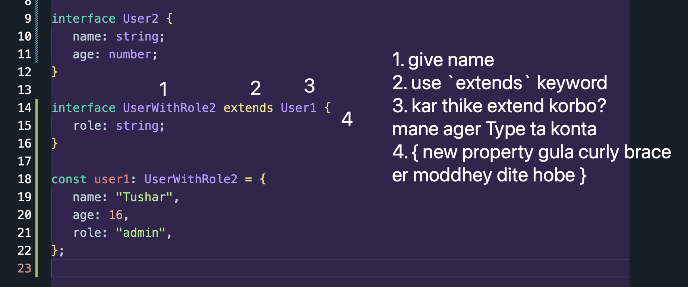

Type alias er jaatbhai hoilo Interface.

Interface diyeo amra type declare korte pari.

### 🟪 How to create using Interface?

using the `interface` keyword

Example,

```ts
interface User1 {
   name: string;
   age: number;
}

const user1: User1 = {
   name: "Tushar",
   age: 20,
};
```

### 🟪 Difference between Type Aliasing and Interface

#### 1. Interface diye shudhu object type define kora jae, primitive type define kora jae na.

Example,


#### 2. Using intersection. Different bhabe korte hobe Interface e.

Example,

Amra normally type aliasing e kibhabe kortam dekhi:

```ts
type User1 = {
   name: string;
   age: number;
};

// intersection use korte partesi
type UserWithRole1 = User1 & { role: string };

const user1: UserWithRole1 = {
   name: "Tushar",
   age: 16,
   role: "admin",
};
```

Akhon dekhbo intersection diye kibhabe korbo.



```ts
interface User2 {
   name: string;
   age: number;
}

interface UserWithRole2 extends User1 {
   role: string;
}

const user1: UserWithRole2 = {
   name: "Tushar",
   age: 16,
   role: "admin",
};
```

QUESTION: Amra ki `type` ke extend korte parbo? And amra ki `intersection` ke type aliasing korte parbo?

ANSWER: Yes we can.


### 🟪 How to create Arrays using Interface

```ts
type Roll1 = number[];

const rollNumbers1: Roll1 = [1, 2, 3];

// akhon think:

// [1,2,3] mane ki ashole mane hoilo,

// {  [0]:1, [1]:2, [2]:2  }

// so aitao kintu akta object, jeikhane [index] hoilo akta number and tar value o akta number

interface Roll2 {
   [index: number]: number;
}

const rollNumbers2: Roll2 = [1, 2, 3];
```

### 🟪 How to create Functions using Interface

Normally type use kore korle:

```ts
// type use korle:

type Add1 = (num1: number, num2: number) => number;

const add1: Add1 = (num1, num2) => num1 + num2;
```

Interface use korle:

```ts
interface Add2 {
   (num1: number, num2: number): number;
}

const add2: Add2 = (num1, num2) => num1 + num2;
```

### 🟪 Konta use korbo?

Array and Function er belae - Type Alias
Object er khetre - Jekono akta korlei hoy
