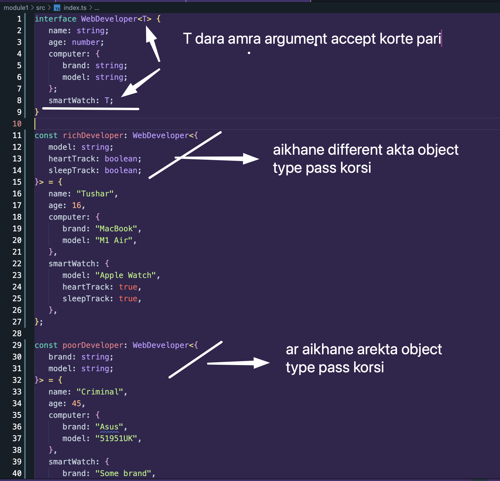
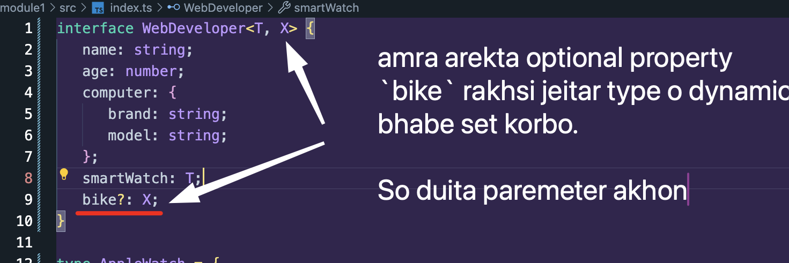
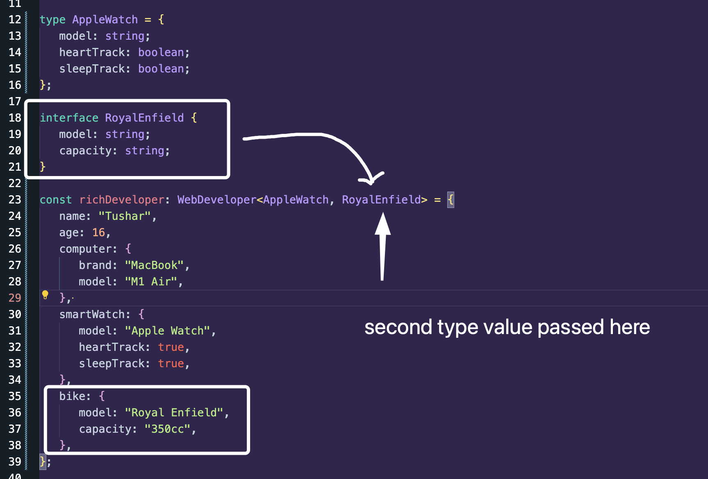
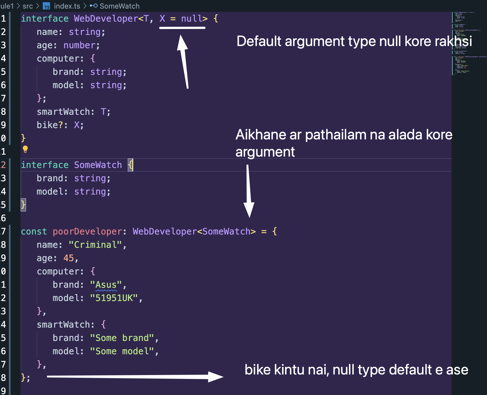

Goto lesson e amra `type` diye generic type create korsi. Ai lesson e dekhbo `interface` diye kibhabe generic type banae.

💡 Amra goto lesson er ai code the simply korte pari:

```ts
const developer1: GenericTuple<number, { name: string; email: string }> = [
   1234,
   { name: "Tushar", email: "t@t.com" },
];
```

Object type alada define kore:

```ts
type UserObj1 = { name: string; email: string }; // hoy type diye

interface UserObj2 {
   // na hoy interface diye
   name: string;
   email: string;
}

const developer1: GenericTuple<number, UserObj2> = [
   1234,
   { name: "Tushar", email: "t@t.com" },
];
```

## Let us create more generic types using Interface

Generic er main purpose ta ki abar mone koro.. To make reusable type.

Akhon ai example ta dekhi then bujhai.

```ts
interface WebDeveloper<T> {
   name: string;
   age: number;
   computer: {
      brand: string;
      model: string;
   };
   smartWatch: T; // aikhane T ta argument hishebe niye pass korsi smart watch e
}

const richDeveloper: WebDeveloper<{
   model: string; // aikhane T te amra object pass kortesi
   heartTrack: boolean;
   sleepTrack: boolean;
}> = {
   name: "Tushar",
   age: 16,
   computer: {
      brand: "MacBook",
      model: "M1 Air",
   },
   smartWatch: {
      model: "Apple Watch",
      heartTrack: true,
      sleepTrack: true,
   },
};

const poorDeveloper: WebDeveloper<{
   brand: string; // aikhaneo amra object pass kortesi kintu different properties e
   model: string;
}> = {
   name: "Criminal",
   age: 45,
   computer: {
      brand: "Asus",
      model: "51951UK",
   },
   smartWatch: {
      brand: "Some brand",
      model: "Some model",
   },
};
```



## Writing the above code in a cleaner way:

Object er type ta variable e structure na kore agei type declare kore fela

```ts
interface WebDeveloper<T> {
   name: string;
   age: number;
   computer: {
      brand: string;
      model: string;
   };
   smartWatch: T;
}

type AppleWatch = {
   model: string; // aikhane amra Type ta declare kore fellam
   heartTrack: boolean;
   sleepTrack: boolean;
};

const richDeveloper: WebDeveloper<AppleWatch> = {
   // aikhane just use kore fellam `AppleWatch` type ta
   name: "Tushar",
   age: 16,
   computer: {
      brand: "MacBook",
      model: "M1 Air",
   },
   smartWatch: {
      model: "Apple Watch",
      heartTrack: true,
      sleepTrack: true,
   },
};
```

also, interface diyeo korte pari, amra variable e object na structure kore agei akta interface diye `SmartWatch` type baniye fellam.

```ts
interface WebDeveloper<T> {
   name: string;
   age: number;
   computer: {
      brand: string;
      model: string;
   };
   smartWatch: T;
}

interface SomeWatch {
   // aikhane amra type ta define kore fellam
   brand: string;
   model: string;
}

const poorDeveloper: WebDeveloper<SomeWatch> = {
   // aikhane just `SmartWatch` type ta use kore fellam
   name: "Criminal",
   age: 45,
   computer: {
      brand: "Asus",
      model: "51951UK",
   },
   smartWatch: {
      brand: "Some brand",
      model: "Some model",
   },
};
```

## 🟪 🔥 Multiple arguments while making Generic type



poor developer er bike nai so null pass kore disi,

pass kortei hobe as duita argument must have..

and rich developer e aibhabe use kore disi:



## 🟪 Passing Default Argument

Jehutu bike optional rakhsilam, and alada Null na pathaye amra default e Null kore dei? tailei to aro bhalo.
Bike thakle type declare korbo. Na thakle Null to bolar dokar nai, default jate thake.:


