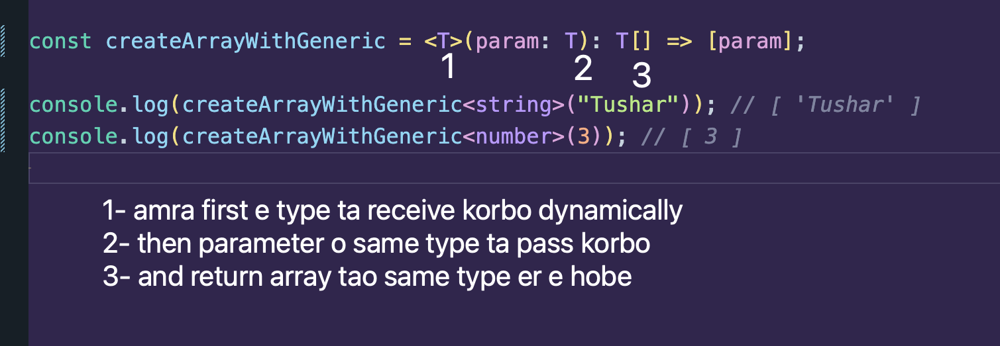
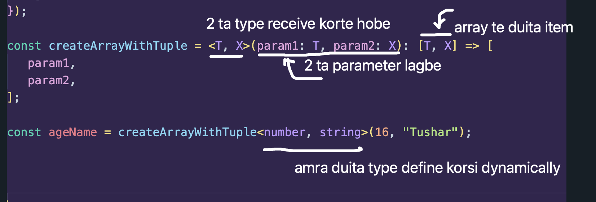

Ok ai function ta dekho

```ts
const createArray = (param: string): string[] => [param];

console.log(createArray("Tushar"));
```

ai function e amra ki kortesi? akta string value pass kortesi jeita akta array hoitese.

So amra bar bar string e ki pathabo? onno kichu pathaileo to jatey oi type er array create hoy shei khetre amra generic korte pari.

Kibhabe function generic korbo? Aibhabe:

```ts
const createArrayWithGeneric = <T>(param: T): T[] => [param];

console.log(createArrayWithGeneric<string>("Tushar")); // [ 'Tushar' ]
console.log(createArrayWithGeneric<number>(3)); // [ 3 ]
```

Niyom ta ki?



Object pass korle aibhabe kortam:

```ts
const createArrayWithGeneric = <T>(param: T): T[] => [param];

const resultGenObj = createArrayWithGeneric<{ name: string; age: number }>({
   name: "tushar",
   age: 16,
});
```

Cleaner way te likhte chaile type ta agei define kore felte pari:

```ts
const createArrayWithGeneric = <T>(param: T): T[] => [param];

type User = { name: string; age: number };

const resultGenObj = createArrayWithGeneric<User>({
   name: "tushar",
   age: 16,
});
```

## Creating Tuple:

```ts
const createArrayWithTuple = <T, X>(param1: T, param2: X): [T, X] => [
   param1,
   param2,
];

const ageName = createArrayWithTuple<number, string>(16, "Tushar");

console.log(ageName); // [ 16, 'Tushar' ]
```



### Object o pathaite pari in a tuple

```ts
type User = { name: string; age: number };

const createArrayWithTuple = <T, X>(param1: T, param2: X): [T, X] => [
   param1,
   param2,
];

const ageName = createArrayWithTuple<number, User>(16, {
   name: "Tushar",
   age: 16,
});
```

Another example:

-  amra bahir thike object pathabo oita dynamically set hobe, and fix akta property built in thakbe jeitar name `course`

```ts
const addCourseToStudent = <T>(param: T) => {
   const course = "Next Level Web Development";

   return {
      ...param,
      course,
   };
};

const student1 = addCourseToStudent<{ name: string; email: string }>({
   name: "Tushar",
   email: "tushar@gmail.com",
});

const student2 = addCourseToStudent<{ id: number; hasLaptop: boolean }>({
   id: 1516,
   hasLaptop: true,
});
```
