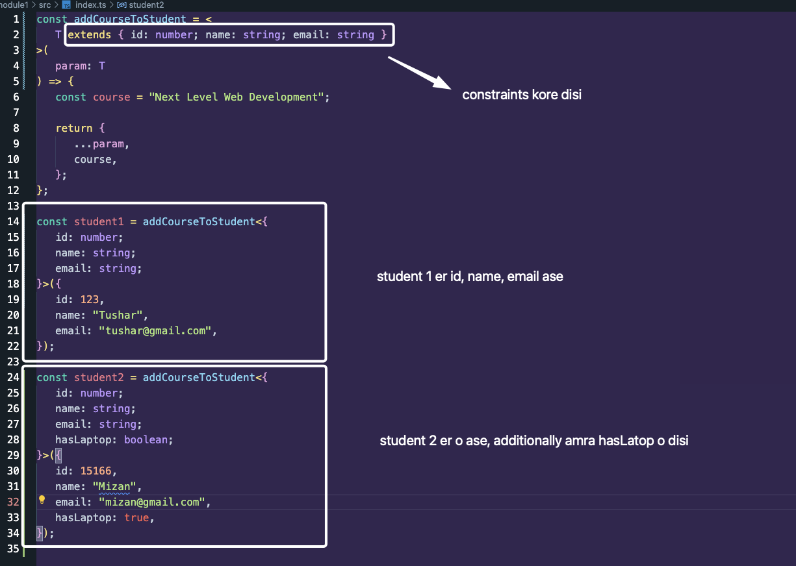

## 🟪 Why Need Constraints

Constraints meaning force kore kono rule apply kora.

Goto lesson er last er example e amon dekhsilam right?

```ts
const addCourseToStudent = <T>(param: T) => {
   const course = "Next Level Web Development";

   return {
      ...param,
      course,
   };
};

const student1 = addCourseToStudent<{ name: string; email: string }>({
   name: "Tushar",
   email: "tushar@gmail.com",
});

const student2 = addCourseToStudent<{ id: number; hasLaptop: boolean }>({
   id: 1516,
   hasLaptop: true,
});
```

Kintu problem is, amra Student er e je object paisi sheita bujhbo kibhabe? Cause ami to faka akta object pass korleo amar akta student create hoye jabe.

student1 e jemon khali name and email ase, student2 abar just id and hasLatop ase.. duita student dui rokom. So akta niyom jodi ante chai je - Na, amader ai property gula must thaktei hobe student howar jonne, jemon, `id, name and email` lagbei.

So ai problem ta solve korbe `Constraints`

## 🟪 Making Constraints

-  Type jeikhane receive hocchey oikhane amra rule, `constraints`, diye dibo.
-  using `extends` keyword

```ts
const addCourseToStudent = <
   T extends { id: number; name: string; email: string }
>(
   param: T
) => {
   const course = "Next Level Web Development";

   return {
      ...param,
      course,
   };
};
```


Now,


