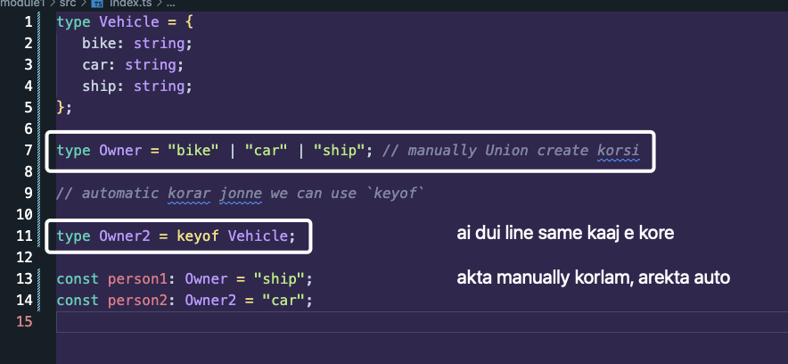
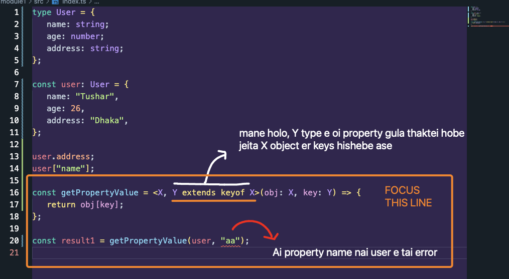

Amader jodi need hoy je, akta object type er `key` gula niye amra akta string `union` type create korbo.



Code:

```ts
type Vehicle = {
   bike: string;
   car: string;
   ship: string;
};

type Owner = "bike" | "car" | "ship"; // manually Union create korsi

// automatic korar jonne we can use `keyof`

type Owner2 = keyof Vehicle;

const person1: Owner = "ship";
const person2: Owner2 = "car";
```

#### Another Example:

Amra usually jokhon object thike property nite chai amra usually ki kori? Hoy dot notation ba bracket notation use kori tai na?

```ts
const user = {
   name: "Tushar",
   age: 26,
   address: "Dhaka",
};

user.address;
user["name"];
```

Like above right?

Akhon nicher example e dekho je, amra dynamically akta object pass kortesi and dynamically Constraint set kore dite partesi. Cause mone rekho, condition set kore deyar jonne `union` kora lage. And union amra manually o korte pari abar `key of` use koreo korte pari.

And goto lecture e mone kore dekho je amra `extends` use korsi to make constraints.


