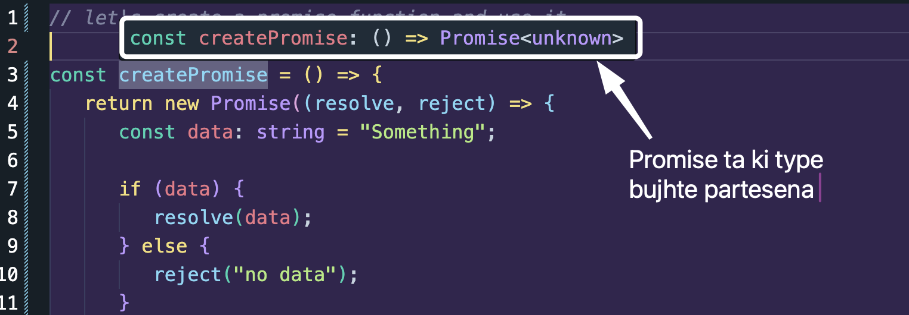
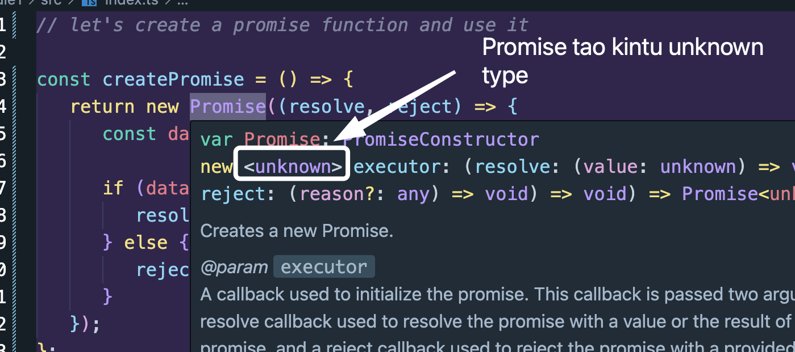
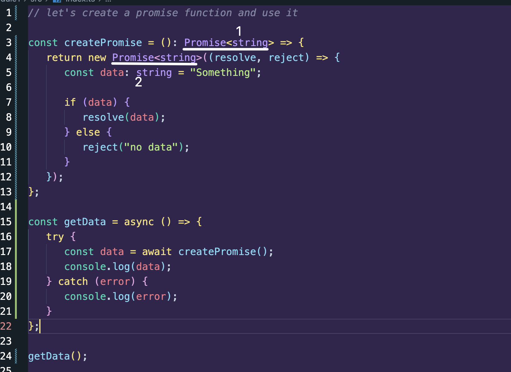
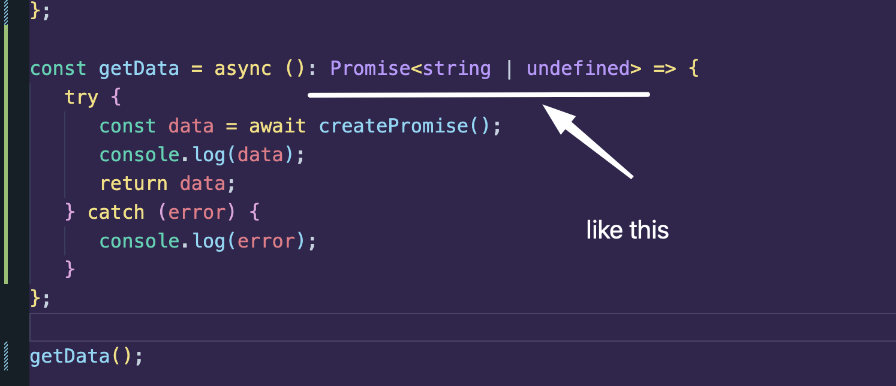
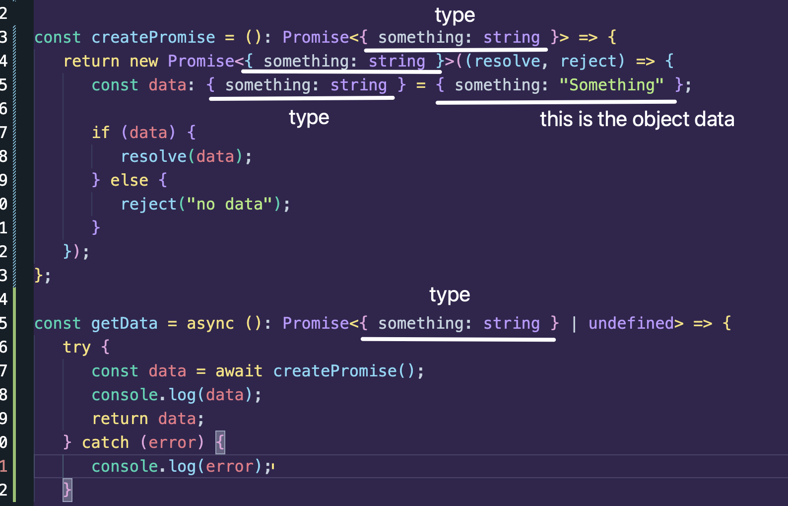
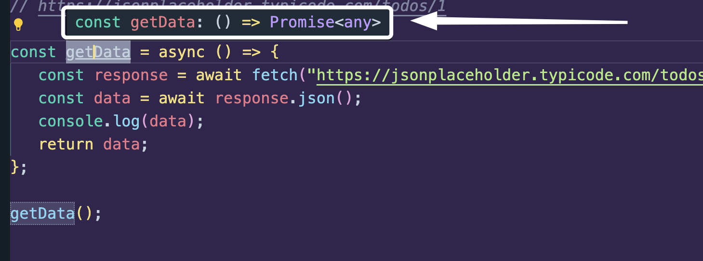

## 🟪 Custom Promise and How to Use TypeScript

Let us create a basic promise and simulate an API calling.

```ts
// let's create a promise function and use it

const createPromise = () => {
   return new Promise((resolve, reject) => {
      const data: string = "Something";

      if (data) {
         resolve(data);
      } else {
         reject("no data");
      }
   });
};

const getData = async () => {
   try {
      const data = await createPromise();
      console.log(data);
   } catch (error) {
      console.log(error);
   }
};

getData();
```

So akhon ai duita message ta dekho,



---



So amra both, ai function ta ki type er Promise return kortese and Promise er type tao ki both solve korte partesi aibhabe below:



Code:

```ts
// let's create a promise function and use it

const createPromise = (): Promise<string> => {
   return new Promise<string>((resolve, reject) => {
      const data: string = "Something";

      if (data) {
         resolve(data);
      } else {
         reject("no data");
      }
   });
};

const getData = async () => {
   try {
      const data = await createPromise();
      console.log(data);
   } catch (error) {
      console.log(error);
   }
};

getData();
```

---

-  notice one more thing, getData akta Promise return kortese oitar type amra bole dei nai. Amra explicitly bole dite pari aibhabe



---

Amra chaile object return korte pari. Shei khetre aibhabe changes gula ashbe:



To make code cleaner we can make an object `type` outside named `Something`

```ts
// let's create a promise function and use it

type Something = { something: string }; // <----- this one

const createPromise = (): Promise<Something> => {
   return new Promise<Something>((resolve, reject) => {
      const data: Something = { something: "Something" };

      if (data) {
         resolve(data);
      } else {
         reject("no data");
      }
   });
};

const getData = async (): Promise<Something | undefined> => {
   try {
      const data = await createPromise();
      console.log(data);
      return data;
   } catch (error) {
      console.log(error);
   }
};

getData();
```

## Let's Fetch data from real API now

```ts
const getData = async () => {
   const response = await fetch("https://jsonplaceholder.typicode.com/todos/1");
   const data = await response.json();
   console.log(data);
};

getData();
```

IMPORTANT NOTE: API thike complex data type ashte pare. Example, object er moddhey arrays. Or array r moddhey objects. Shei khetre getData r type ta hobe `Promise<any>`



Kintu jehutu aita akta choto data return kortese and amra type tao jani. Amra explicitly bolte pari ki type er data ashtese. Like this:
