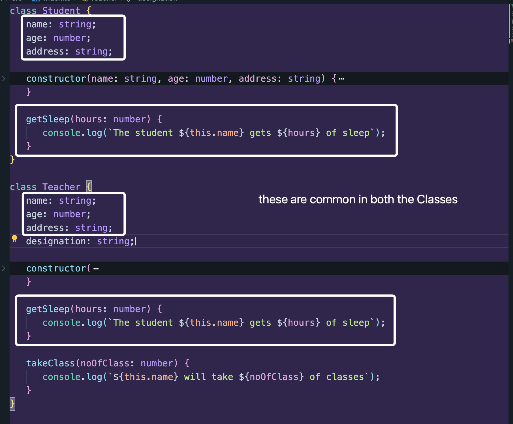
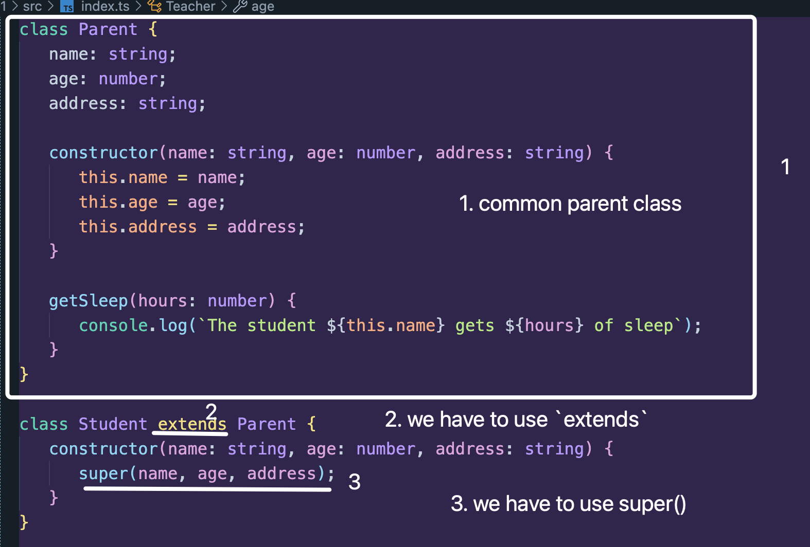
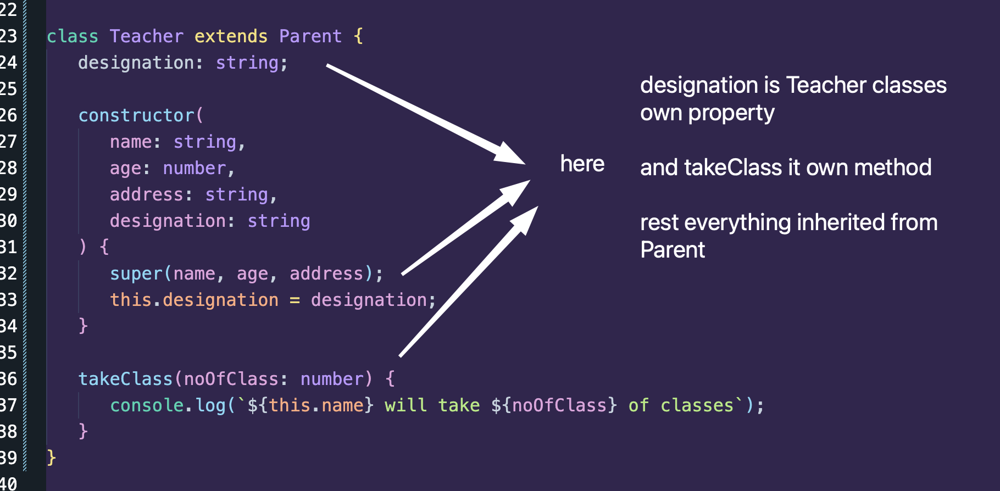

Akhon jehutu common ase, amra akta parent class banaite pari easily common properties gula reuse korar jonne.

Then `extends` korbo.

And `super` call korbo.



-  Parent thike ja e `extends` kori na kori, `constructor` function obosshoi akta class e lagbe. Ken lage? Nahole jokhon object instance create korbo, value gula pathabo kemne?
-  Super() call kore amra child er constructor thike value gula, Parent er constructor e pathaye dibo.

Likewise, Teacher Class tao recode kori:



---

## Full Code

```ts
class Parent {
   name: string;
   age: number;
   address: string;

   constructor(name: string, age: number, address: string) {
      this.name = name;
      this.age = age;
      this.address = address;
   }

   getSleep(hours: number) {
      console.log(`The student ${this.name} gets ${hours} of sleep`);
   }
}

class Student extends Parent {
   constructor(name: string, age: number, address: string) {
      super(name, age, address);
   }
}

class Teacher extends Parent {
   designation: string;

   constructor(
      name: string,
      age: number,
      address: string,
      designation: string
   ) {
      super(name, age, address);
      this.designation = designation;
   }

   takeClass(noOfClass: number) {
      console.log(`${this.name} will take ${noOfClass} of classes`);
   }
}

const student1 = new Student("Tushar", 16, "Dhaka");
student1.getSleep(7); // The student Tushar gets 7 of sleep
const teacher1 = new Teacher("Mr.X", 40, "Mirpur", "Professor");
teacher1.takeClass(10); // Mr.X will take 10 of classes
```
