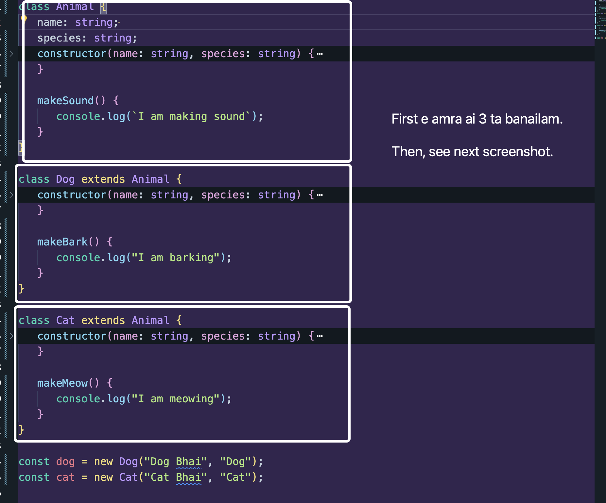
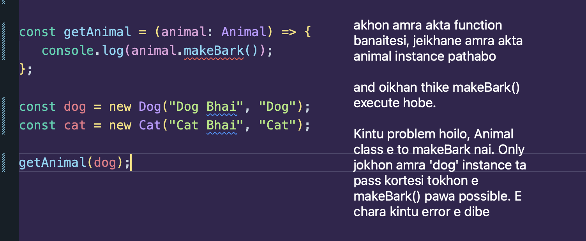
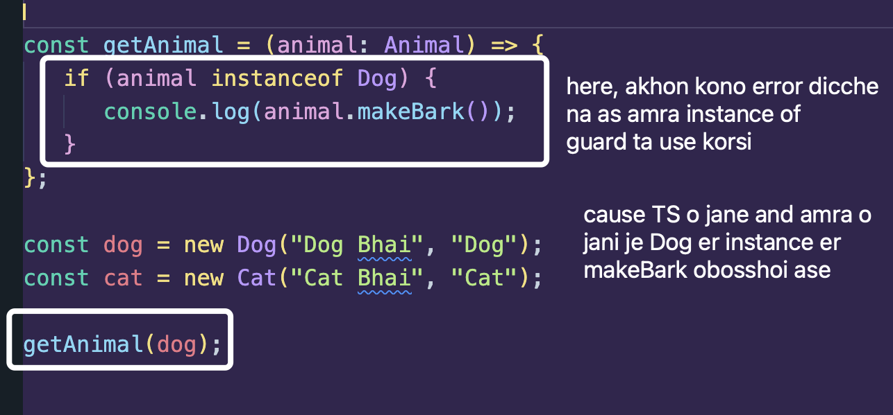
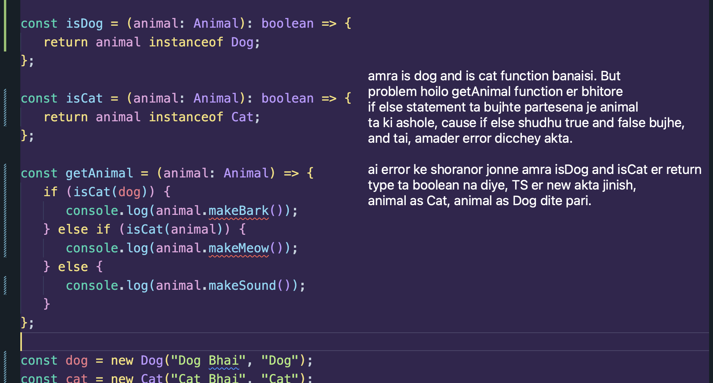

---



---

Solution? amra `instanceof` use korte pari.

instance of guard type jeita kore, akta class er instance hoile then kichu actions allow korbe.

amader aikhane jemon `makeBark` shudhu Dog er class er ase and jei instance Dog class dara hobe, shudhu sheigula tei to `makeBark` ta thakbe right?

So now,



now let us complete the function:

```ts
class Animal {
   name: string;
   species: string;
   constructor(name: string, species: string) {
      this.name = name;
      this.species = species;
   }

   makeSound() {
      console.log(`I am making sound`);
   }
}

class Dog extends Animal {
   constructor(name: string, species: string) {
      super(name, species);
   }

   makeBark() {
      console.log("I am barking");
   }
}

class Cat extends Animal {
   constructor(name: string, species: string) {
      super(name, species);
   }

   makeMeow() {
      console.log("I am meowing");
   }
}

const getAnimal = (animal: Animal) => {
   if (animal instanceof Dog) {
      console.log(animal.makeBark());
   } else if (animal instanceof Cat) {
      console.log(animal.makeMeow());
   } else {
      console.log(animal.makeSound());
   }
};

const dog = new Dog("Dog Bhai", "Dog");
const cat = new Cat("Cat Bhai", "Cat");

getAnimal(cat);
```

### Smartly writing instanceof

Kichu syntax error and calling error ase screenshot tae, but concept ta bujho.



Correct way to write code using `animal as Cat or Dog`:

```ts
const isDog = (animal: Animal): animal is Dog => {
   return animal instanceof Dog;
};

const isCat = (animal: Animal): animal is Cat => {
   return animal instanceof Cat;
};

const getAnimal = (animal: Animal) => {
   if (isDog(animal)) {
      console.log(animal.makeBark());
   } else if (isCat(animal)) {
      console.log(animal.makeMeow());
   } else {
      console.log(animal.makeSound());
   }
};
```

### Full Code:

```ts
class Animal {
   name: string;
   species: string;
   constructor(name: string, species: string) {
      this.name = name;
      this.species = species;
   }

   makeSound() {
      console.log(`I am making sound`);
   }
}

class Dog extends Animal {
   constructor(name: string, species: string) {
      super(name, species);
   }

   makeBark() {
      console.log("I am barking");
   }
}

class Cat extends Animal {
   constructor(name: string, species: string) {
      super(name, species);
   }

   makeMeow() {
      console.log("I am meowing");
   }
}

const isDog = (animal: Animal): animal is Dog => {
   return animal instanceof Dog;
};

const isCat = (animal: Animal): animal is Cat => {
   return animal instanceof Cat;
};

const getAnimal = (animal: Animal) => {
   if (isDog(animal)) {
      console.log(animal.makeBark());
   } else if (isCat(animal)) {
      console.log(animal.makeMeow());
   } else {
      console.log(animal.makeSound());
   }
};

const dog = new Dog("Dog Bhai", "Dog");
const cat = new Cat("Cat Bhai", "Cat");

getAnimal(cat);
```
