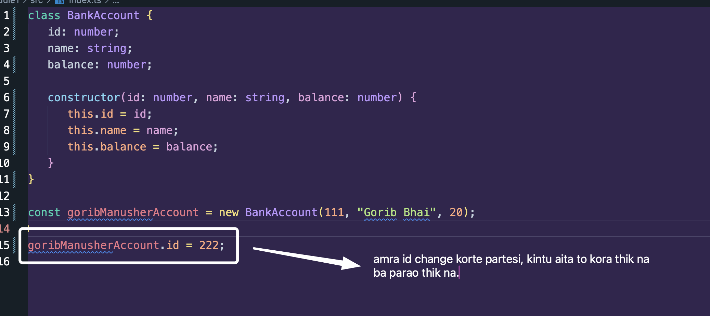
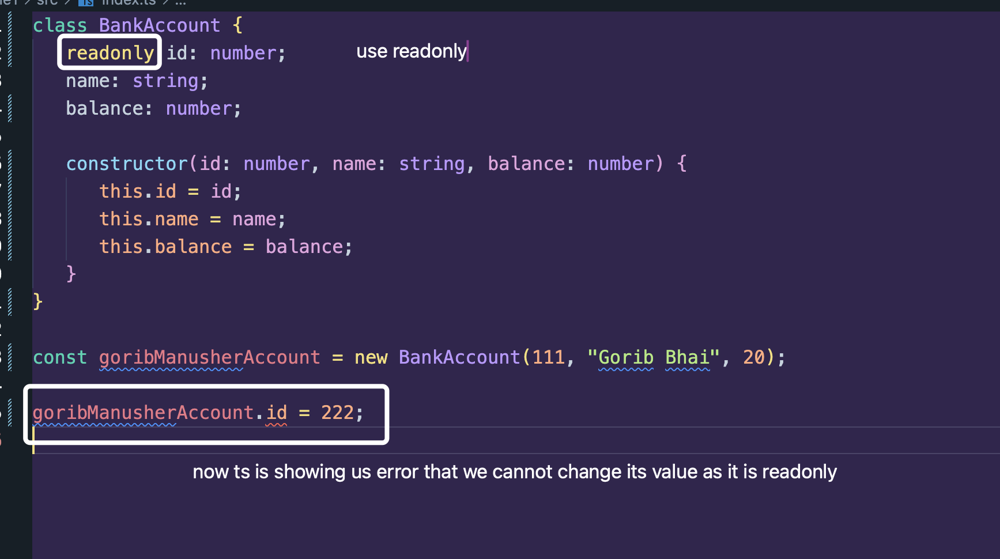
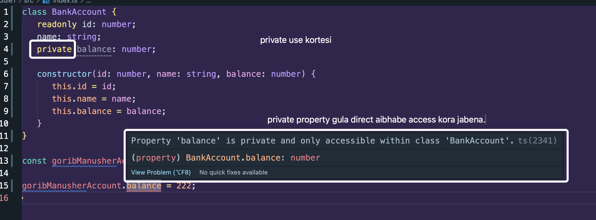
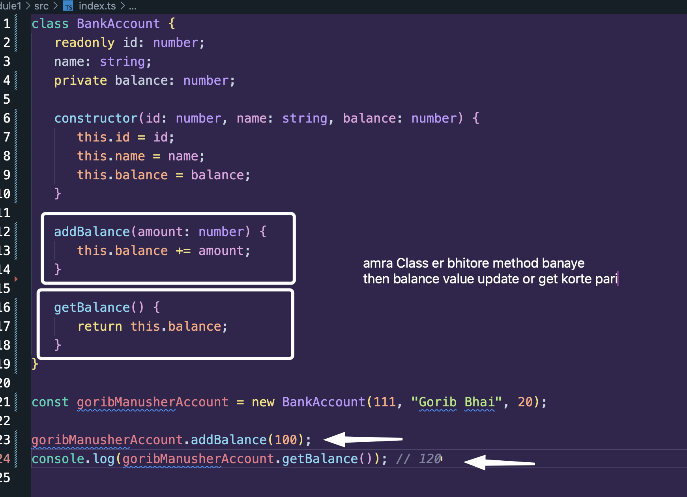
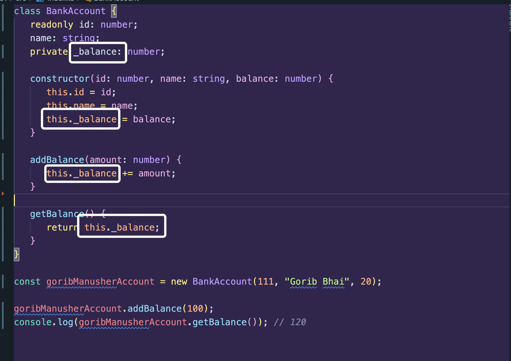
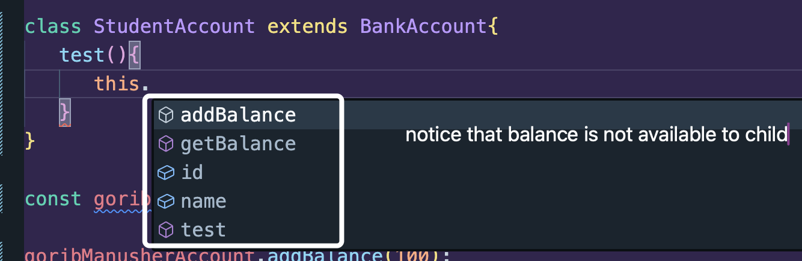
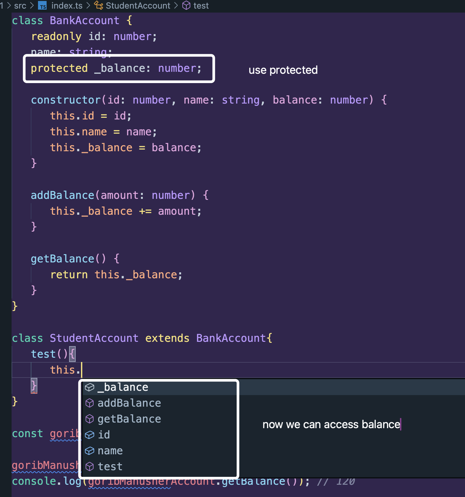

Ok so one of the access modifiers is `readonly`



---

But balance kintu readonly kora jabena, cause balance obosshoi update hobe. readonly mane to akbar e value set kora jabe.

then next modifier hocchey - `private`



Kibhabe parbo? Class er bhitor thike parbo. Like this:



---

### Convention of using private property (using `_`)



### Private property r jaat bhai `Protected`:

Akhon private use korle jeita problem hobe, amra jodi arekta Class ke extend kori parent Class thike, then private property gula access kora jae na.



To solve the issue, we have to replace `private` with `protected`:



### Full Code:

```ts
class BankAccount {
   readonly id: number;
   name: string;
   protected _balance: number;

   constructor(id: number, name: string, balance: number) {
      this.id = id;
      this.name = name;
      this._balance = balance;
   }

   addBalance(amount: number) {
      this._balance += amount;
   }

   getBalance() {
      return this._balance;
   }
}

class StudentAccount extends BankAccount {
   test() {
      this._balance;
   }
}

const goribManusherAccount = new BankAccount(111, "Gorib Bhai", 20);

goribManusherAccount.addBalance(100);
console.log(goribManusherAccount.getBalance()); // 120
```
