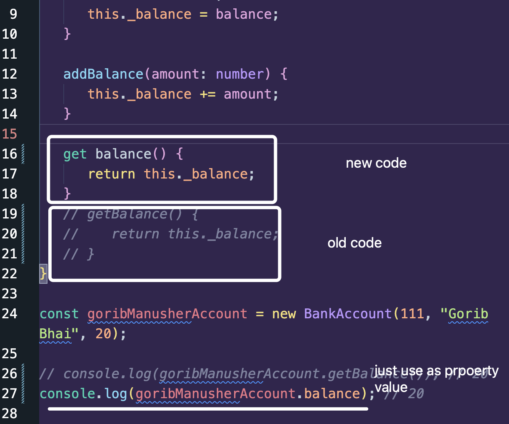
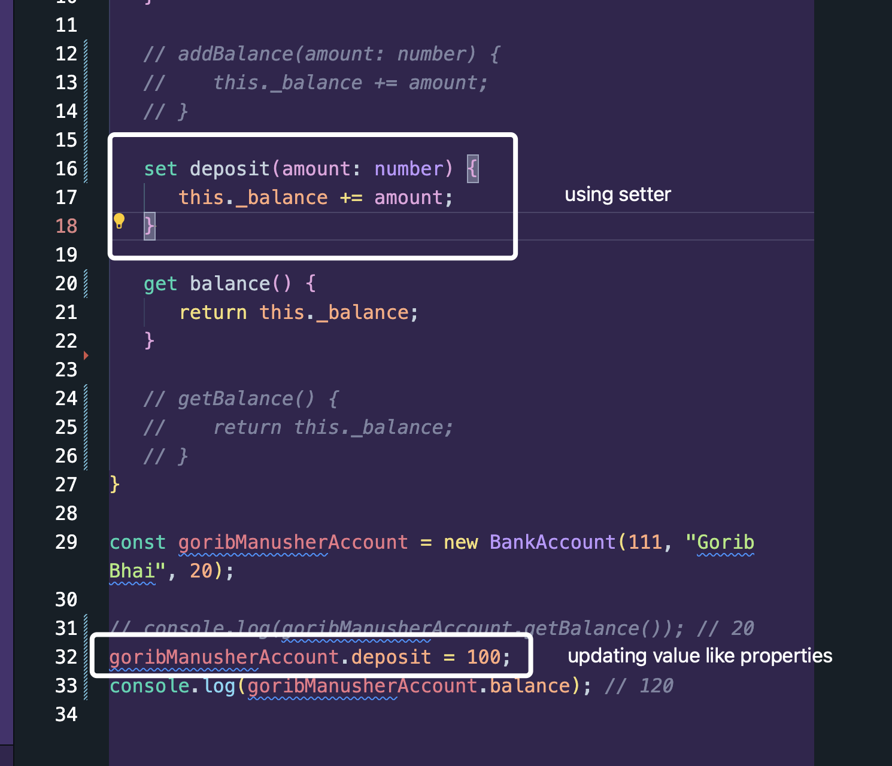

In our previous lesson, to get and deposit balance we have made methods and `called` the functions right?

But using `getter` and `setter` amra property er name jeibhabe pai, oibhabei lekhlei value peye jabo.



Similarly to assign values we can use setter function:



### Full Code:

```ts
class BankAccount {
   readonly id: number;
   name: string;
   protected _balance: number;

   constructor(id: number, name: string, balance: number) {
      this.id = id;
      this.name = name;
      this._balance = balance;
   }

   set deposit(amount: number) {
      this._balance += amount;
   }

   get balance() {
      return this._balance;
   }
}

const goribManusherAccount = new BankAccount(111, "Gorib Bhai", 20);

goribManusherAccount.deposit = 100;
console.log(goribManusherAccount.balance); // 120
```
