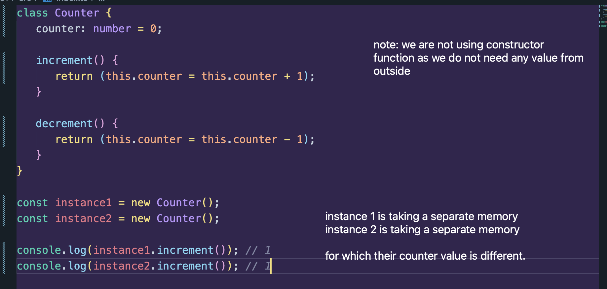
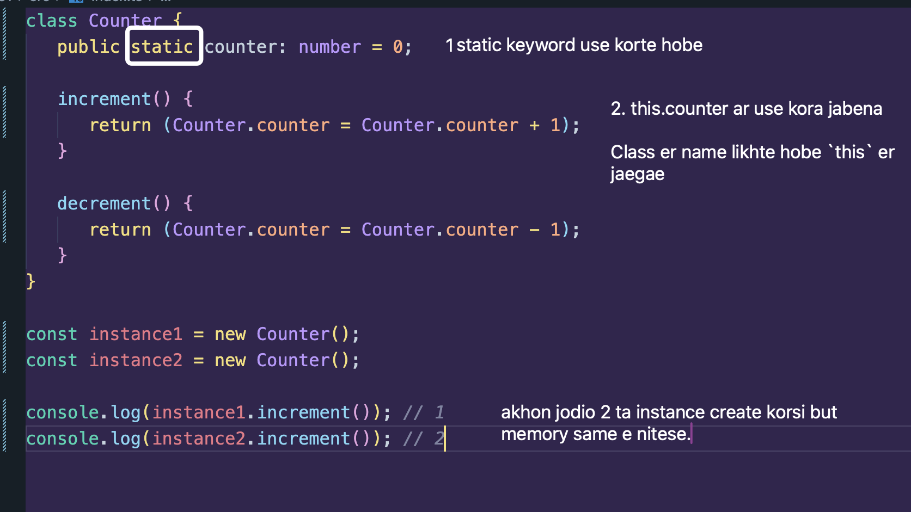
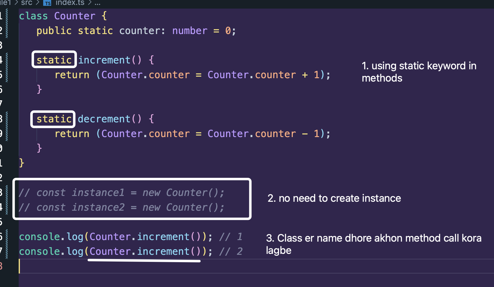

OOP te, Static e memory change hoyna.

## First e aktu bujhi ken static use korte jacchi:



Akhon amra jodi chai je `counter` er value different memory te thakbena, same memory tei thakbe. Tahole: amader oi property er agey `static` keyword use korte hobe.



static deyar foley - ai property ta akta premium property hishebe kaaj kortesena. So access korte gele `this` diye kora jabena, Class er name diye korte hobe

Arekbhabe jodi chinta kori, this to dynamically bujhae, and Class name diye kore dile akdom static e bujhaitese right?

## Method kibhabe static korbo tahole and korle ki ar instance create korte hobe?

Method jehutu amra static korbo, shei khetreo kintu Class er name dhore daka lagbe. And instance create korar dorkar nai.



## Full Code:

```ts
class Counter {
   public static counter: number = 0;

   static increment() {
      return (Counter.counter = Counter.counter + 1);
   }

   static decrement() {
      return (Counter.counter = Counter.counter - 1);
   }
}

// const instance1 = new Counter();
// const instance2 = new Counter();

console.log(Counter.increment()); // 1
console.log(Counter.increment()); // 2
```
