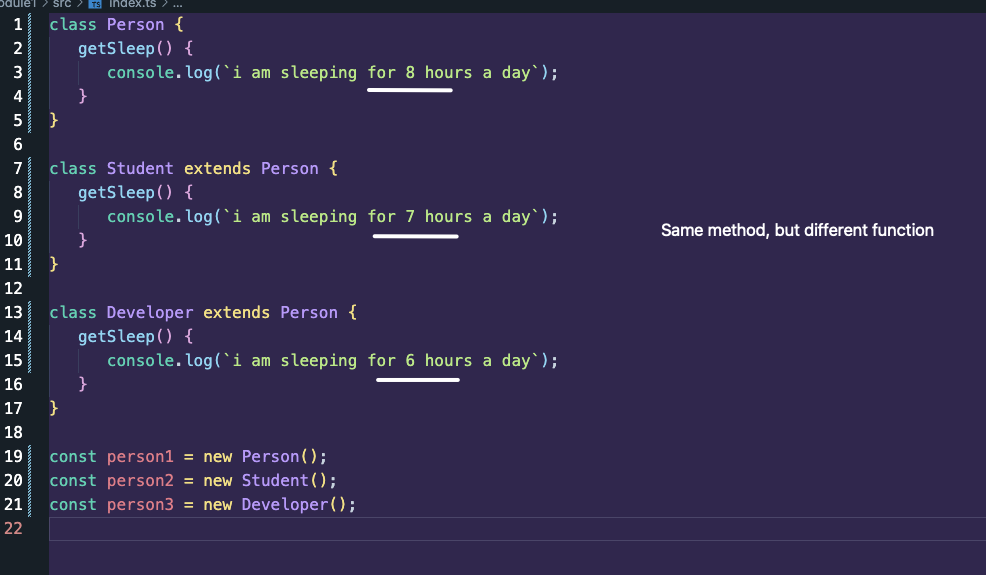
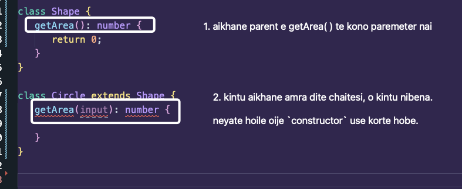
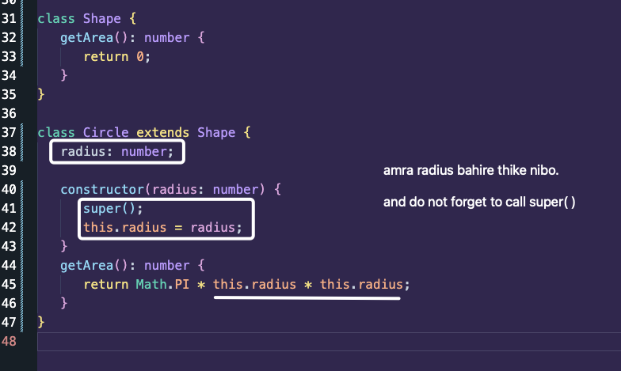
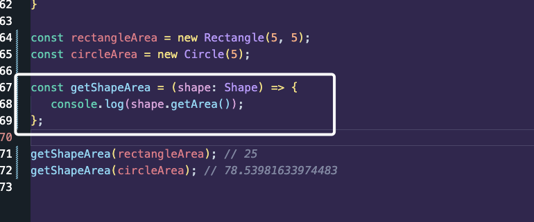

2nd pillar of OOP

## What is Polymorphism

In JavaScript, polymorphism in object-oriented programming (OOP) allows objects to share behaviors while maintaining their own unique implementations.



Here in the above example, amader method er name same, kintu different result dibe jodi oder ke call dei.

Arektu bujhar jonne let's say akta function banai: `getSleepingHours`

ai function e amra akta instance pass korbo and just instance er method ta call korbo.

Kheyal kori je method kintu same, so bhejal nai je kon instance pass korsi, kintu method same hoileo output kintu same na.

Ai je rup bodailo situation er shathe, aitai polymorphism

```ts
class Person {
   getSleep() {
      console.log(`i am sleeping for 8 hours a day`);
   }
}

class Student extends Person {
   getSleep() {
      console.log(`i am sleeping for 7 hours a day`);
   }
}

class Developer extends Person {
   getSleep() {
      console.log(`i am sleeping for 6 hours a day`);
   }
}

const getSleepingHours = (person: Person) => {
   console.log(person.getSleep());
};

const person1 = new Person();
const person2 = new Student();
const person3 = new Developer();

getSleepingHours(person1); // i am sleeping for 8 hours a day
getSleepingHours(person2); // i am sleeping for 7 hours a day
getSleepingHours(person3); // i am sleeping for 6 hours a day
```

### Another Example:

IMPORTANT NOTE: Method er name/ parameters kintu same thakte hobe. Cause, same na hoile error dibe.

Jemon, amra child Class er method e akta parameter nitesi, kintu parent e chilona, taile kintu hobena.

So taile child e jodi argument value lage taile kibhabe nibo? Nibo `constructor` function er thru te.



This way:



Same way te Rectangle akta class korte pari and instance o create kore check korte pari:

```ts
class Shape {
   getArea(): number {
      return 0;
   }
}

class Circle extends Shape {
   radius: number;

   constructor(radius: number) {
      super();
      this.radius = radius;
   }
   getArea(): number {
      return Math.PI * this.radius * this.radius;
   }
}

const circleArea = new Circle(5);
console.log(circleArea.getArea()); // 78.53981633974483

class Rectangle extends Shape {
   height: number;
   width: number;

   constructor(height: number, width: number) {
      super();
      this.height = height;
      this.width = width;
   }

   getArea(): number {
      return this.height * this.width;
   }
}

const rectangleArea = new Rectangle(5, 5);
console.log(rectangleArea.getArea()); // 25
```

So amra jodi common akta function banai:



Code:

```ts
class Shape {
   getArea(): number {
      return 0;
   }
}

class Circle extends Shape {
   radius: number;

   constructor(radius: number) {
      super();
      this.radius = radius;
   }
   getArea(): number {
      return Math.PI * this.radius * this.radius;
   }
}

class Rectangle extends Shape {
   height: number;
   width: number;

   constructor(height: number, width: number) {
      super();
      this.height = height;
      this.width = width;
   }

   getArea(): number {
      return this.height * this.width;
   }
}

const rectangleArea = new Rectangle(5, 5);
const circleArea = new Circle(5);

const getShapeArea = (shape: Shape) => {
   console.log(shape.getArea());
};

getShapeArea(rectangleArea); // 25
getShapeArea(circleArea); // 78.53981633974483
```
