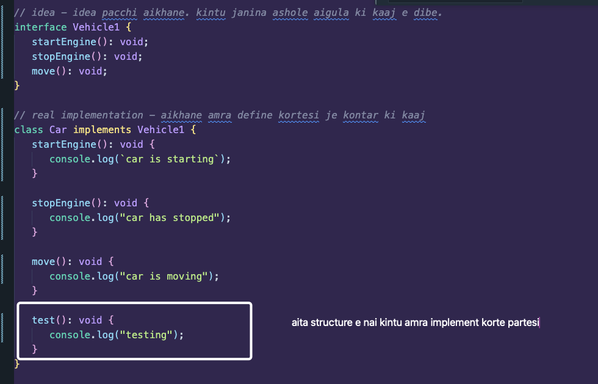

Abstraction mane real jinish janbona, kintu akta idea pabo.

Example, React use kori, bhitore ki hoise janina, kintu idea niye kaaj kori and use kori.

## 🟪 Abstraction using Interface:

Class declare korar time e amra jodi kono structure oitakey dite chai, i.e, amra jodi kono type use korte chai, amra normally `:` dile hobena, amader `implements` keyword ta use kore bolte hobe.

Example:

```ts
// idea - idea pacchi aikhane. kintu janina ashole aigula ki kaaj e dibe.
interface Vehicle1 {
   startEngine(): void;
   stopEngine(): void;
   move(): void;
}

// real implementation - aikhane amra define kortesi je kontar ki kaaj
class Car implements Vehicle1 {
   startEngine(): void {
      console.log(`car is starting`);
   }

   stopEngine(): void {
      console.log("car has stopped");
   }

   move(): void {
      console.log("car is moving");
   }
}

const car = new Car();

car.move();
```

### Can we add other methods even though we used a Type?

Yes we can:



## 🟪 Abstraction using Abstract class:

Aita aita leader class.

We follow the leader right.

SO amra same akta class banabo, jakey shobai follow korbe.

-  Amra abstract class thike kono kichu create korte parbona, but follow korte parbo
-  So amader jodi kono instance create kora lage, shei khetre akta child Class er agey create kore neya lagbe.
-  Ai abstract class ta hobe amader 'idea' class. Real implementation kintu abstract e korbona
-  Abstract use korle `implements` use er jaegae `extends` use korte hobe

Example:

```ts
abstract class Vehicle2 {
   abstract startEngine(): void;
   abstract stopEngine(): void;
   abstract moveEngine(): void;
}

class Car2 extends Vehicle2 {
   startEngine(): void {
      console.log(`car is starting`);
   }

   stopEngine(): void {
      console.log("car has stopped");
   }

   moveEngine(): void {
      console.log("car is moving");
   }

   test(): void {
      console.log("testing");
   }
}

const toyota = new Car2();

toyota.stopEngine(); // car has stopped
```

---

NOTE: VIDEO LECTURE E ABAR DEKHTE PARO JODI POLYMORPHISM AND ABSTRACTION USING ABSTRACT E CONFUSED HOU.

https://web.programming-hero.com/level2-batch-4/video/level2-batch-4-3-9-abstraction-in-oop
